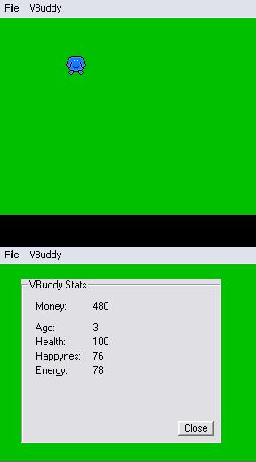



## \_VBuddy\_

### Description

This is a game i wrote in Visual Basic 6.

Its the first game ive ever worked hard on, yet a long way from done and still very small there are still things you do to keep your VBuddy alive.

He can live to a ripe old age of 76 or untill his health gets to 0 (Done in many ways).

At then end it will give you a rank of how good/bad you were to your VBuddy.

Please post feedback!

This was tested with VB 6.0 and Windows XP.

Tell me of bugs you find.
 
### More Info
 

             |
---                |---
**Submitted On**   |2002-11-21 13:34:26
**By**             |[Gary Boyd](https://github.com/Planet-Source-Code/PSCIndex/blob/master/ByAuthor/gary-boyd.md)
**Level**          |Beginner
**User Rating**    |4.5 (18 globes from 4 users)
**Compatibility**  |VB 6\.0
**Category**       |[Games](https://github.com/Planet-Source-Code/PSCIndex/blob/master/ByCategory/games__1-38.md)
**World**          |[Visual Basic](https://github.com/Planet-Source-Code/PSCIndex/blob/master/ByWorld/visual-basic.md)
**Archive File**   |[\_VBuddy\_15012011212002\.zip](https://github.com/Planet-Source-Code/gary-boyd-vbuddy__1-40937/archive/master.zip)

